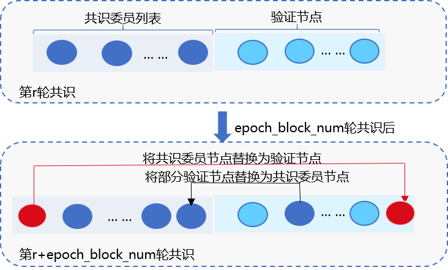

# RPBFT

## 背景

**PBFT算法不具有可扩展性**
PBFT算法网络复杂度是O(n*n)，每轮共识流程中网络带宽占用最高的Prepare包数目与区块链系统中共识节点数目成正比，不具有可扩展性。
**HotStuff算法不具有可扩展性**
Libra采用的HotStuff算法虽然将共识算法网络复杂度降低到O(n)，但每轮共识流程中，网络开销最大的Prepare包的数目仍与共识节点数目成正比，同样不具有可扩展性。

综上所述，构建可扩展的区块链系统，直接采用PBFT或HotStuff不可行，由此提出了RPBFT共识算法。

## RPBFT基本思路

### 核心思想

RPBFT算法在每轮共识流程中，仅选取若干个节点共识出块，并根据区块高度动态更新出块节点。

主要包括2个系统参数：
- **每轮共识参与的节点数目epoch_sealer_num**：每轮共识过程中参与共识的节点数目；写入创世块中，可通过系统表动态配置
- **共识节点动态更新周期epoch_block_num**：为防止选取的共识节点联合作恶，RPBFT每出epoch_block_num个区块后，会剔除一个共识节点，并加入一个新的共识节点；`epoch_block_num`配置项写入创世块中，可通过系统表动态配置

### RPBFT算法流程

设共识节点总数为`sealersNum`，RPBFT共识算法主要流程如下：

**确定各共识节点编号**

对`N`个共识节点`NodeID`进行排序，排序后的列表记为`orderedSealerList`，共识节点`NodeID`在`orderedSealerList`中的索引即为该共识节点编号

**系统初始化时，选取epoch_sealer_num个节点参与共识**

目前实现中，系统初始化时，选取索引为0到`epoch_sealer_num-1`的节点参与共识

**选取的节点运行PBFT共识流程**

选取的`epoch_sealer_num`个共识节点运行PBFT算法，其他节点从这些节点同步区块，同步区块过程中需要执行如下校验：
- **校验区块签名列表**：必须包含至少(2*epoch_sealer_num/3)个来自于被选取节点的签名
- **校验区块执行结果**

**动态更新共识节点列表**

RPBFT每出`epoch_block_num`个区块后，会动态更新共识节点列表，设系统表中记录最新`epoch_block_num`系统配置对应的生效块高为`configUpdatedBlockNumber`，当前块高为`blockNumber`，具体算法流程如下：

- **确定切换周期`rotatingRound`**：节点刚启动时，切换周期为`(blockNumber - configUpdatedBlockNumber) / epoch_block_num`;运行中的系统，每出`epoch_block_num`个区块，`rotatingRound`加一
- **确定起始共识节点索引`startIdx`**：计算公式为`rotatingRound * epoch_block_num`
- **选取`epoch_sealer_num`个共识节点参与共识`chosedConsensusNode`**: 根据前两步计算结果，被选取的共识节点索引为{`startIdx % sealersNum`,  `(startIdx + 1) % sealersNum`, ..., `(startIdx + epoch_sealer_num - 1) % sealersNum`}
- **动态更新共识节点列表**：每出一个块，均返回第一步计算最新的`rotatingRound`,每当`rotatingRound`增加1，均动态更新`chosedConsensusNode`，设`chosedConsensusNode`的最小共识节点索引为`minConsIdx`，最大共识节点索引为`maxConsIndex`，更新共识节点时，从`chosedConsensusNode`中删除索引为`minConsIdx`的共识节点，并加入索引为`(maxConsIndex + 1) % sealersNum`的共识节点，即：
    - `rotatingRound`增加1时，剔除索引为`startIdx`的节点，加入索引为`(startIdx + epoch_sealer_num) % sealersNum`的节点
    - `rotatingRound`增加2时，剔除索引为`startIdx + 1`的节点，加入索引为`(startIdx + epoch_sealer_num + 1) % sealersNum`  的节点
    - `rotatingRound`增加3时，剔除索引为`startIdx + 2`的节点，加入索引为`(startIdx + epoch_sealer_num + 2) % sealersNum`  的节点
    - ... ...

# RPBFT网络优化

## Prepare包树状广播策略

**基本思路**

- 根据共识节点索引，构成完全n叉树(默认是3)

- Leader产生Prepare包后，以Leader为顶点，Prepare消息沿树状拓扑转发，如下图：

  
![[图片]](../../../images/consensus/broadcast_prepare_by_tree.png)

## 容错方案

**基本思路**

- 类似于交易广播，每个节点维护rawPrepareReq状态，rawPrepareReq缺失时，根据rawPrepareReq状态去相应节点拉取最新的rawPrepareReq；
- 用本方案优化bip152协议，节点缺失交易时，不一定向Leader请求缺失的交易，可以向任意拥有最新rawPrepareReq的节点请求；

**主要流程**

- 开启树状广播时，节点addRawPrepareCache，随机挑选30%节点广播rawPrepare包状态rawPrepareStatus，包括{blockNumber, blockHash, view, idx};
- 节点收到rawPrepareStatus后，首先判断rawPrepareStatus对应的Prepare包是否是新的：(1) rawPrepareStatus.blockNumber是否大于当前块高；(2) rawPrepareStatus的状态是否比本地缓存的rawPrepareCache新；若rawPrepareStatus比节点当前的状态新，且节点与父节点断连，则向相应节点发出rawPrepareRequest请求，请求相应的rawPrepare包；
- 节点收到rawPrepareRequest请求后，若本地缓存相应的rawPrepareCache，则向请求节点回复包含rawPrepare包的rawPrepareResponse；
- 节点收到rawPrepareResponse后，取出rawPrepare包，运行handlePrepare的流程。

## 流量负载均衡策略

### 背景
PBFT/RPBFT启用bip协议后，其他共识节点交易缺失后，向leader请求交易，导致leader出带宽成为瓶颈；
这里利用了【Prepare包树状广播方案】中的rawPrepare状态同步，优化了缺失交易拉取策略；

### 基本思路
![[图片]](../../../images/consensus/bip_load_balance.png)

上图展示了主要处理流程：(设是三叉树)
leader的子节点sealerA的主要处理流程如下：
- leader产生新区块后，将仅包含交易哈希列表的Prepare包发送给三个子节点；
- 子节点sealerA收到Prepare包后，将其沿树状拓扑转发给三个子节点；
- 子节点sealerA开始处理Prepare包：
  (1) 从交易池中获取命中的交易，填充到Prepare包内的区块中；
  (2) 向父节点(这里为leader)请求缺失的交易
- sealerA收到Leader的回包后，将回包内的交易填充到Prepare包内；并随机选取30%的节点广播Prepare包的状态，主要包括{blockHash, blockHeight, view, leader_idx}，其他节点收到该状态包后，将最新的状态包更新到缓存中；

sealerA的子节点sealerB的主要处理流程如下：
- sealerB收到SealerA转发过来的Prepare包后，同样继续将该Prepare包转发给sealerB的子节点；
- sealerB开始处理Prepare包：
  (1) 从交易池中获取命中的交易，填充到Prepare包的区块中；
  (2) 选取节点获取缺失的交易：(优选选取父节点)
  ① 获取父节点(这里为sealerA)
  ② 若sealerB的缓存中已经有来自sealerA且符合要求的Prepare状态包：则直接选取sealerA作为缺失交易请求节点；
  ③若sealerB的缓存中没有来自sealerA且符合要求的Prepare状态包，但是有来自其他节点符合要求的状态包(状态包哈希与Prepare包哈希一致)，则从中随机选出一个节点去请求缺失交易；
  ④ 若sealerB缓存中没有符合要求的Prepare状态包，则最多等待100ms后，向Leader请求；
  (3) sealerB向选出的节点请求缺失交易；
- sealerB获取缺失交易，并填充满Prepare包后，同样随机选取30%的节点广播Prepare包状态，他节点收到该状态包后，将最新的状态包更新到缓存中；

## RPBFT配置项

RPBFT主要包括三个配置项，均位于`group.*.genesis`文件中，会写入创世块：

- `consensus_type`: 配置为`rotating_pbft`即开启RPBFT，默认为`PBFT`
- `epoch_sealer_num`: 每轮参与共识节点的数目，可通过控制台动态修改，默认为共识节点数目
- `epoch_block_num`: 共识节点动态切换间隔块高，默认为1000
